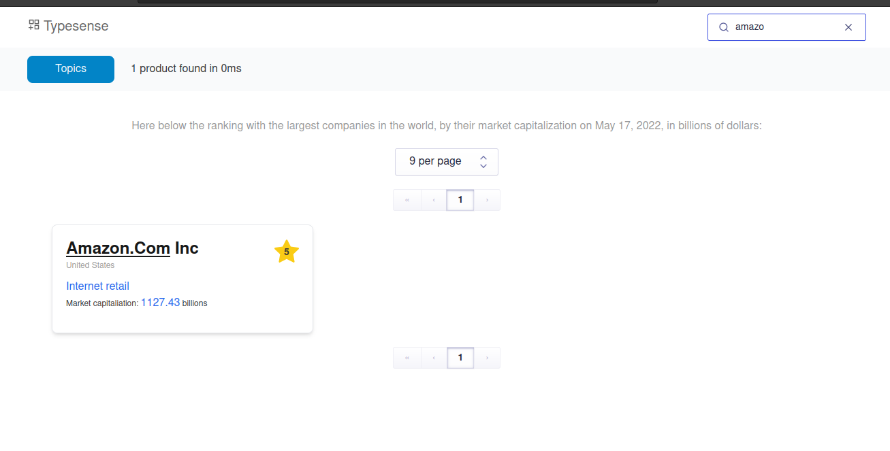
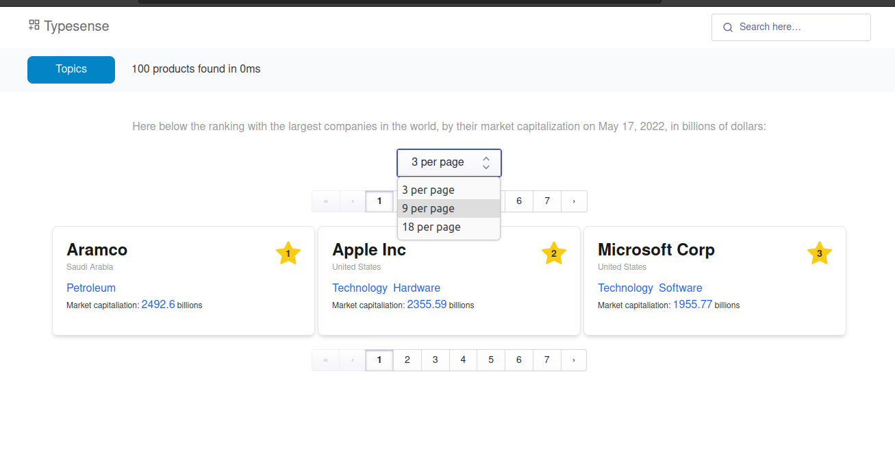
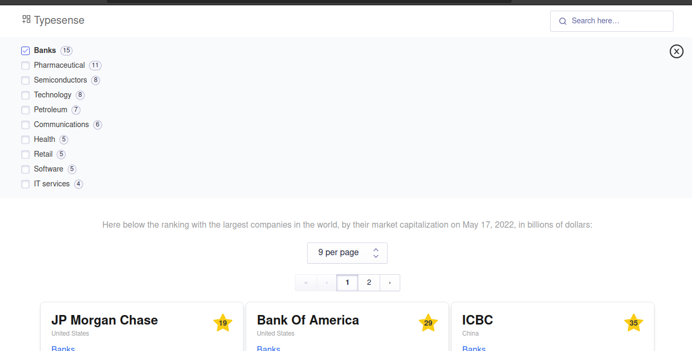
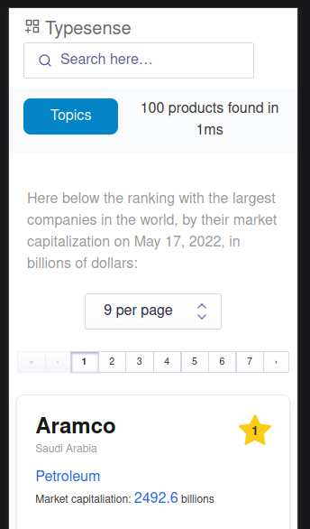

    

    
    
    
    
    
    
    
    

## 🛠️ Installation Steps

    git clone https://github.com/FedericoGabrielCastro/learTypesense.git
    cd estrel
    npm install

## 🚀 Run code

    npm run start-typesense-server
    npm run populate
    npm run dev
    enjoy ! 

| Example | Description |
| ------| ----  |
|  | [Search.](https://typesense.org/docs/0.23.1/api/search.html#search-parameters) Search for "business, country, sector" in the database to return the desired item. |
|  | [Items per page.](https://typesense.org/docs/0.23.1/api/search.html#pagination)  You can edit the number of rendered elements followed by a pagination component to calculate the totality of items. |
|  | [Topics.](https://www.algolia.com/doc/api-reference/widgets/refinement-list/react/) Search through the sectors provided by the database, showing the number of total items that each sector has. |
| 

 | 
 Available for web, tablet and mobile.     min-width: 320px   min-height: 100vh |